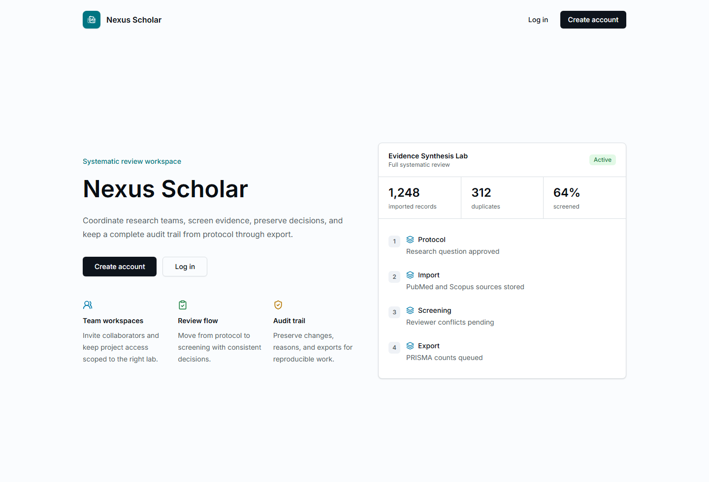
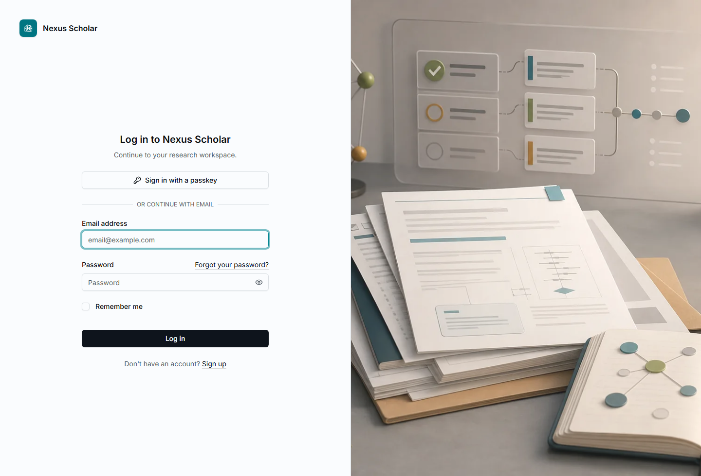
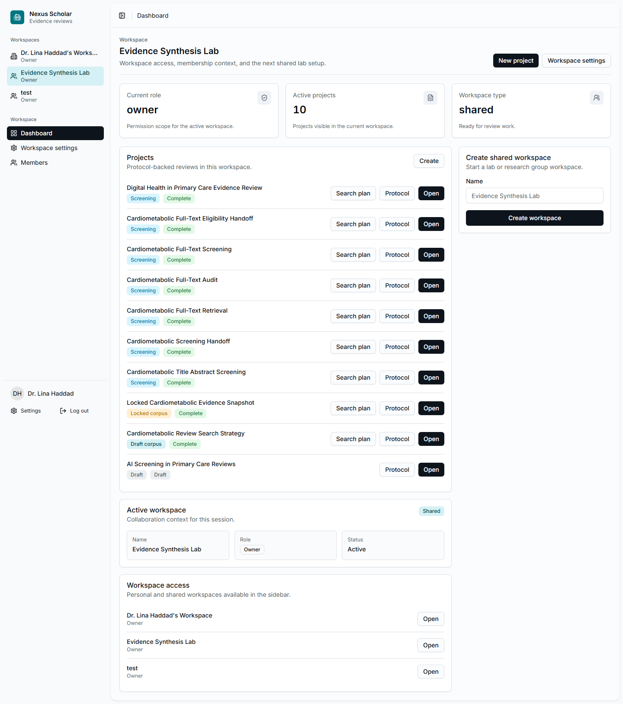

# 1. Sign In And Open The Lab

Start from the Nexus Scholar welcome screen.

{ .screenshot }

## Sign In

1. Select **Log in**.
2. Enter your email address and password.
3. Select **Log in** again.

{ .screenshot }

If you are testing a local training build, use the workspace owner account
provided with the demo environment. In a hosted lab, use your normal account.

## Choose The Lab Workspace

After login, open the workspace switcher in the left sidebar and choose the lab
that owns the review. In the walkthrough, that workspace is **Evidence
Synthesis Lab**.

{ .screenshot }

## Checkpoint

Before creating or opening a review, confirm:

- the sidebar says **Nexus Scholar**;
- the active workspace is the correct lab;
- you can see **Dashboard**, **Workspace settings**, and **Members** if you are
  the workspace owner or admin.
