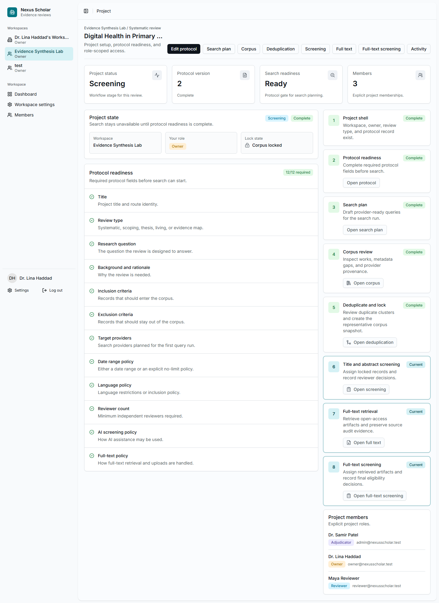
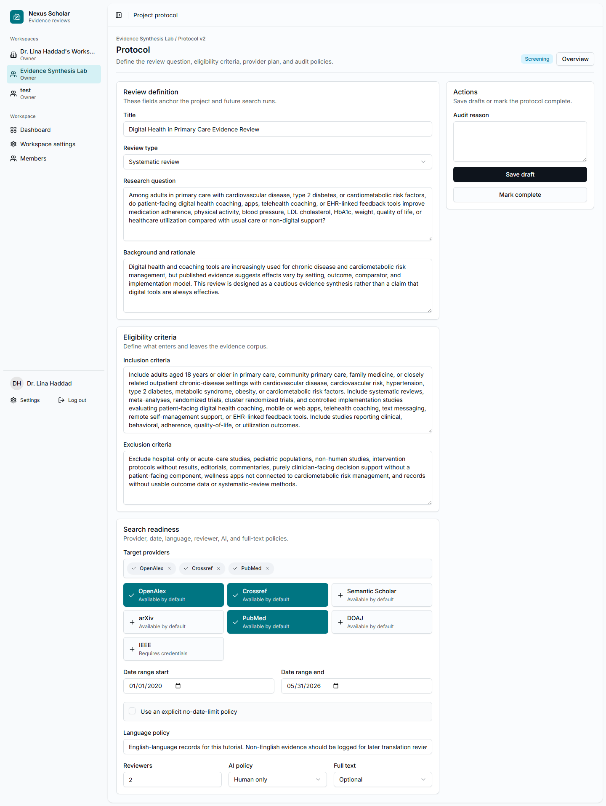

# 2. Create The Project And Protocol

The protocol is the review contract. It tells the team what question is being
asked, which records are eligible, which providers will be searched, and how
screening and full text should be handled.

## Open Or Create The Project

From the dashboard, select an existing project or choose **New project**. The
walkthrough project is:

`Digital Health in Primary Care Evidence Review`

{ .screenshot }

## Complete The Protocol

Select **Edit protocol** and enter the protocol values from the
[real evidence example](../demo-review.md):

- review type: **Systematic review**;
- research question;
- background and rationale;
- inclusion criteria;
- exclusion criteria;
- target providers: `openalex`, `crossref`, `pubmed`;
- date range: `2020-01-01` to `2026-05-31`;
- reviewer count: `2`;
- AI screening policy: **Human only** for this tutorial;
- full-text policy: **Optional**.

{ .screenshot }

## Mark The Protocol Complete

After every required field is complete, mark the protocol complete. Nexus
Scholar then opens the search-planning workflow.

!!! note "Why the tutorial uses human-only screening"
    AI assistance can be useful when it is explicitly enabled and audited. This
    tutorial keeps the scientific example human-reviewed so the screenshots and
    counts do not depend on a model response.

## Checkpoint

The project overview should show:

- protocol version `2`;
- protocol status **Complete**;
- search readiness **Ready**;
- the project members who will own, review, or adjudicate the work.
