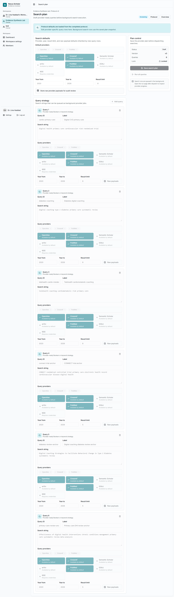
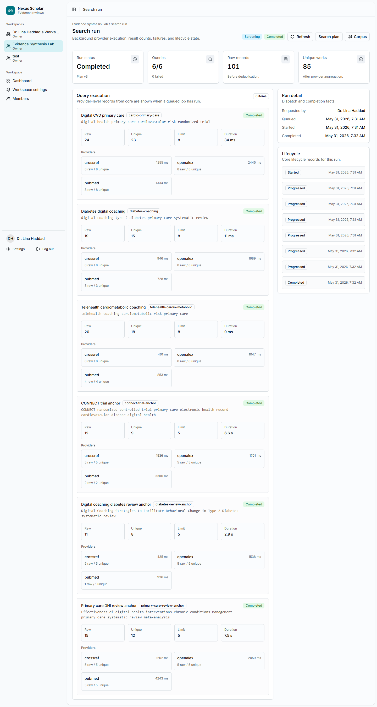

# 3. Plan And Run Searches

The search plan translates the protocol into provider-ready queries. In this
example, the team uses broad discovery queries plus targeted anchor queries.

## Open Search Plan

From the project overview, select **Search plan**.

{ .screenshot }

## Add Queries

Use the six query strings listed in [Real Evidence Example](../demo-review.md).
Set the provider list to:

`openalex`, `crossref`, `pubmed`

Use the date range `2020` to `2026` and keep result limits small while
learning the workflow. The tutorial used result limits of `8` for broad
queries and `5` for anchor queries.

## Run The Plan

Select **Run search plan**. Nexus Scholar queues the run in the background so
the page remains usable.

{ .screenshot }

## Read The Search Run

For the walkthrough run:

- 6 query items completed;
- 101 raw records were returned across providers;
- the run reported 85 unique item-level results;
- 0 provider items failed.

These numbers are not the final corpus count. The corpus later combines query
links and locks a representative snapshot.

## Checkpoint

Move forward when every query item is complete or when the team has reviewed
any provider failures and decided whether to rerun the search.
