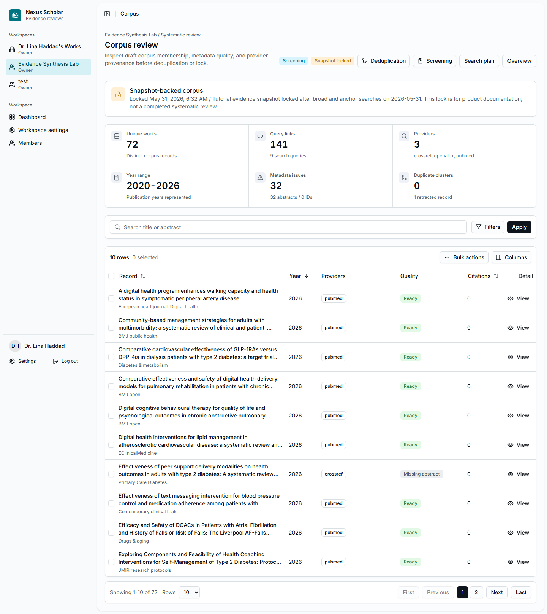

# 4. Inspect The Corpus

The corpus page shows the records returned by the search before and after the
lock. It is where the team checks whether the search is plausible before
screening starts.

## Open Corpus

From the project overview or search run, select **Corpus**.

{ .screenshot }

## Inspect The Counts

The locked walkthrough corpus shows:

- 72 unique representative works;
- 141 query links;
- 3 providers: Crossref, OpenAlex, and PubMed;
- records from 2020 to 2026;
- 32 metadata issues, mostly missing abstracts;
- 0 duplicate clusters found in this run.

## Use Filters And Columns

Use the search field and **Filters** to narrow the table by title, abstract,
provider, year, metadata quality, or other visible fields. Use **Columns** when
you need a quieter table for review meetings or a wider table for provenance
inspection.

Real searches contain noise. In this example, the corpus includes highly cited
guidelines, unrelated clinical records, protocols, and relevant digital-health
records. That is expected. The point of this step is to catch major search
problems before locking the corpus.

## Checkpoint

Before deduplication and lock, confirm:

- the expected providers are represented;
- the year range matches the protocol;
- known anchor records appear in the corpus;
- obvious search mistakes are documented before the team proceeds.
