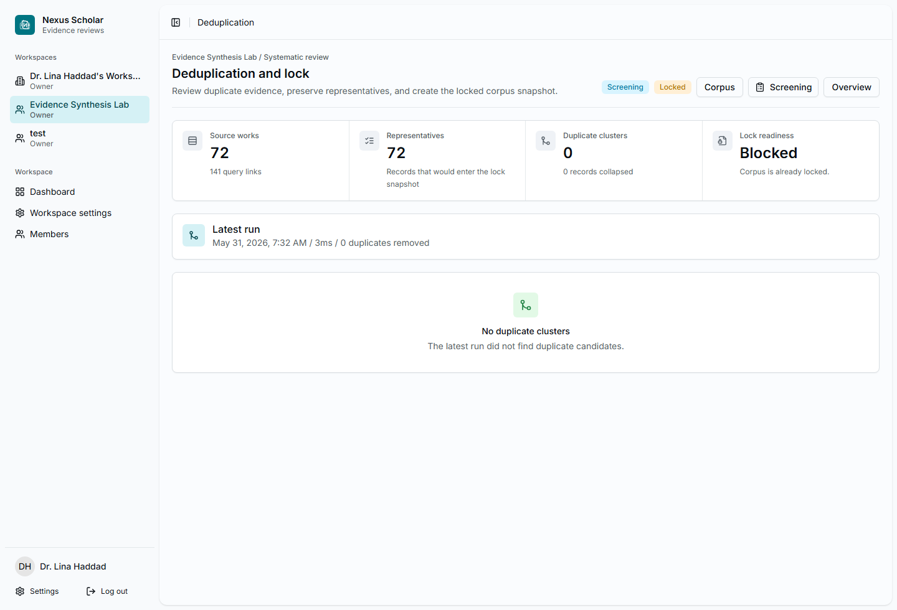

# 5. Deduplicate And Lock

Deduplication reviews whether multiple provider records point to the same
underlying work. Locking freezes the representative corpus so screening can be
audited against a stable set of records.

## Open Deduplication

From the project overview or corpus page, select **Deduplication**.

{ .screenshot }

## Run Deduplication

Select **Run deduplication** when the corpus is ready. In the tutorial run,
Nexus Scholar reviewed 72 source works and found no duplicate clusters. That is
a valid outcome.

If duplicate clusters appear, inspect the representative record before locking.
The representative should be the record the team wants to carry forward into
screening.

## Lock The Corpus

When the team agrees the corpus is ready, select **Lock corpus** and record a
clear reason. The walkthrough used:

`Tutorial evidence snapshot locked after broad and anchor searches on 2026-05-31. This lock is for product documentation, not a completed systematic review.`

## Checkpoint

The corpus page should show **Snapshot locked**. From this point on, screening
uses the locked snapshot, not a changing live search result set.
