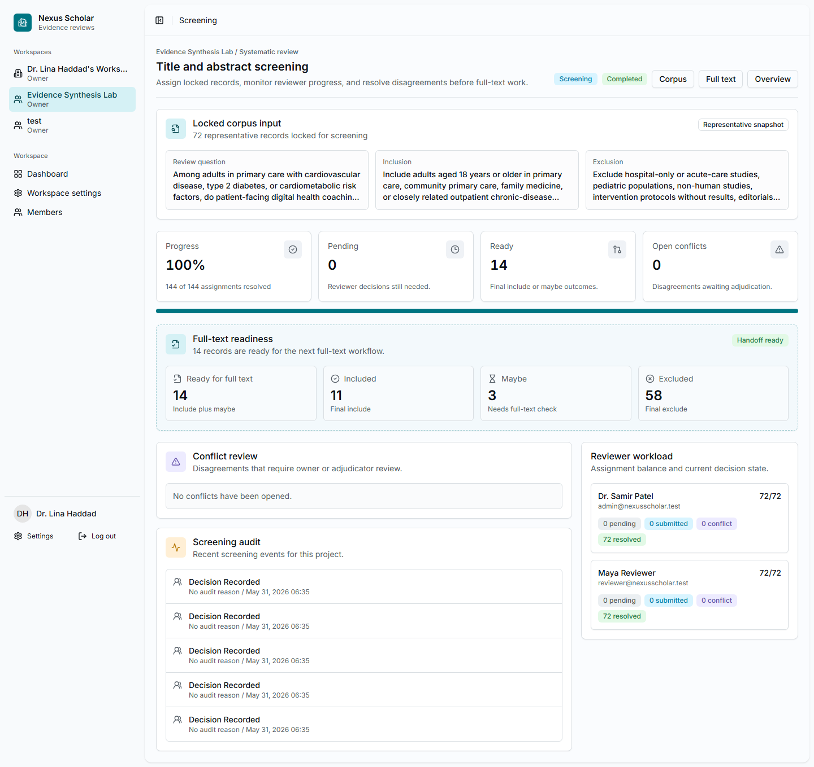

# 6. Screen Titles And Abstracts

Title and abstract screening applies the protocol to each locked record. The
goal is to decide which records should move to full-text retrieval or full-text
review.

## Start A Screening Batch

From the project overview, select **Screening**. Choose the reviewers and the
required reviewer count. The tutorial used two reviewers:

- Maya Reviewer;
- Dr. Samir Patel.

{ .screenshot }

## Record Decisions

Each assigned reviewer opens their queue and records one of three decisions:

| Decision | Use when |
| --- | --- |
| Include | The title and abstract clearly match the protocol. |
| Maybe | The record may match, but full text is needed to confirm eligibility. |
| Exclude | The record clearly fails one or more eligibility criteria. |

Every decision should include a short rationale. For example:

`Matches the protocol population or setting and evaluates a patient-facing digital, coaching, app, telehealth, text-message, or EHR-linked intervention.`

## Tutorial Outcome

The real corpus had 72 locked records. The training screening pass produced:

- 11 include outcomes;
- 3 maybe outcomes;
- 58 exclude outcomes;
- 14 records ready for full-text retrieval.

These numbers are a workflow demonstration, not a scientific conclusion.

## Checkpoint

Move to full-text retrieval when the screening batch is complete and every open
conflict has been resolved or carried forward according to the protocol.
