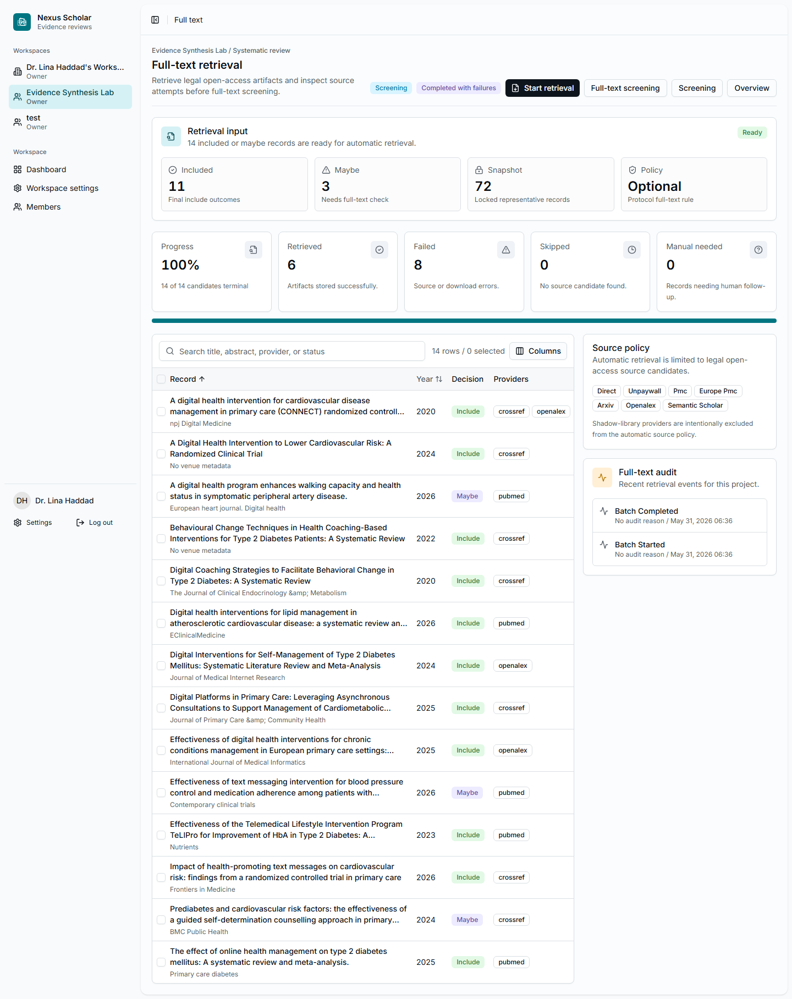

# 7. Retrieve Full Text

Full-text retrieval attempts to fetch legal open-access artifacts for records
that were included or marked maybe during title and abstract screening.

## Open Full Text

From the project overview or screening page, select **Full text**.

{ .screenshot }

## Start Retrieval

Select **Start retrieval**. Nexus Scholar queues the retrieval in the
background and writes an audit trail for each candidate.

The tutorial run had:

- 14 candidates;
- 6 retrieved artifacts;
- 8 failed retrievals;
- 0 skipped records;
- 0 manual-needed records.

Failures are normal. A failed automatic retrieval does not mean the study is
irrelevant. It means the team should decide whether manual follow-up is needed.

## Read The Source Policy

Automatic retrieval is limited to legal open-access sources. The product does
not use shadow-library providers.

## Checkpoint

Move to full-text screening when the retrieval batch is terminal and at least
one successful artifact is ready for review. Keep failed items in the audit
trail so the team can follow up later.
