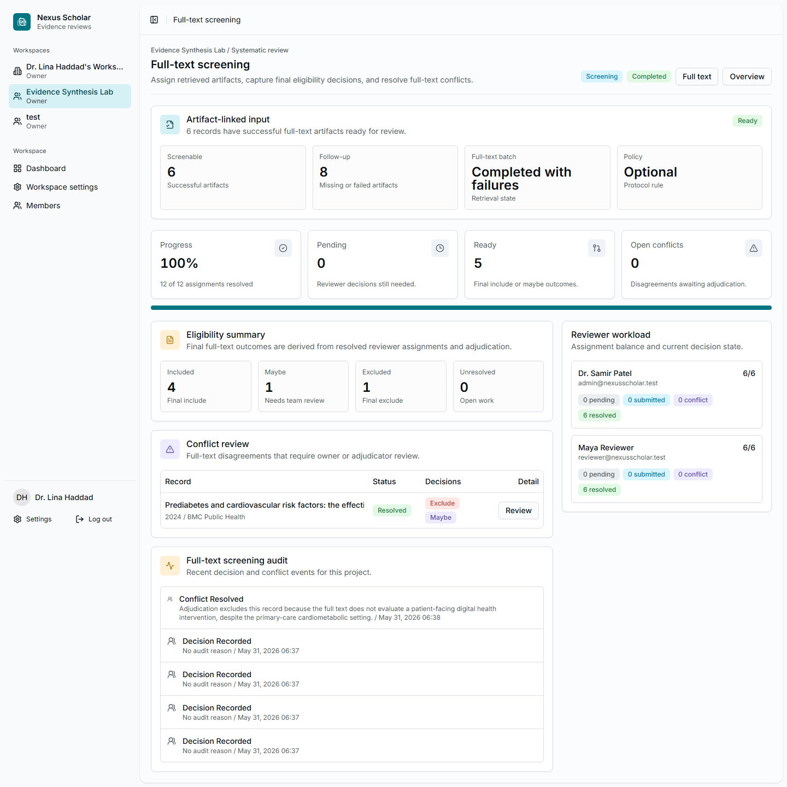
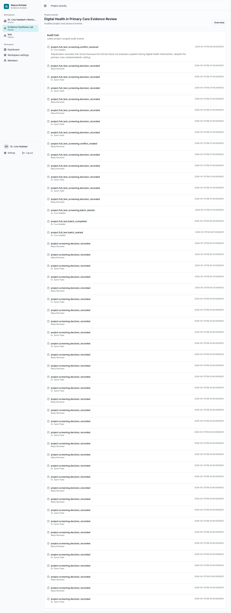

# 8. Screen Full Text

Full-text screening records final eligibility decisions for records with
retrieved artifacts.

## Open Full-Text Screening

From the full-text page, select **Full-text screening**.

{ .screenshot }

## Assign Reviewers

Choose reviewers and the required reviewer count. The tutorial used the same
two reviewers as title and abstract screening.

## Record Eligibility Decisions

Reviewers inspect the linked artifact and record:

- **Include** when the full text satisfies the protocol;
- **Maybe** when senior review is still needed;
- **Exclude** when the full text fails eligibility.

For exclusions, record the exclusion basis. A good exclusion reason names the
criterion that failed, not only a general comment.

## Resolve Conflicts

If reviewers disagree, Nexus Scholar opens a conflict. The owner or adjudicator
selects **Review**, reads the reviewer decisions, chooses the final decision,
and records the audit reason.

In the tutorial, one full-text disagreement was resolved as **Exclude** because
the full text did not evaluate a patient-facing digital health intervention.

## Tutorial Outcome

The completed full-text screening batch produced:

- 4 include outcomes;
- 1 maybe outcome;
- 1 exclude outcome;
- 1 resolved full-text conflict;
- 8 retrieval follow-up items from records without successful artifacts.

The project activity page keeps the workflow audit trail visible after the
screening work is done.

{ .screenshot }

## Checkpoint

At this point, the implemented workflow is complete. The next scientific work
for a real review would be extraction, risk-of-bias or quality appraisal,
synthesis, and reporting. Those workflows are not part of this tutorial yet.
